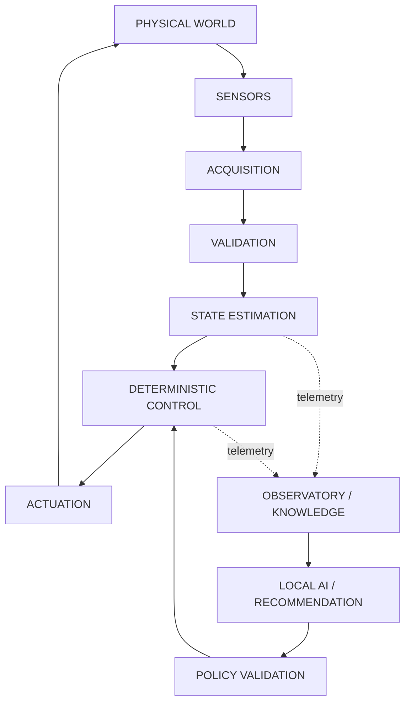

# sovereign-engineering-platform

Engineering systems that operate in the real world.

This repository is an engineering architecture and evidence framework for cyber-physical systems, sovereign infrastructure, deterministic control, local AI, observability, and engineering evolution. It is a specification and evidence structure, not a deployed product, and not a marketing portfolio.

## Positioning

Viktors Simonenko
Senior Systems Architect / Engineering

Specialization areas include systems architecture, cyber-physical systems, embedded and edge engineering, networking, security architecture, local AI, agentic workflows, observability, reliability, and infrastructure.

Core message:

I engineer systems where hardware, software, networks, control logic, data, security, and intelligence operate as one coherent system.

## Canonical Pipeline

Authoritative version with telemetry taxonomy and feedback flow: [architecture/cps/CPS_CONTROL_LOOP.md](architecture/cps/CPS_CONTROL_LOOP.md). Summary only:

AI/Recommendation never writes directly to Deterministic Control; it passes through Policy Validation per [architecture/security/AI_AUTHORITY_CONTRACT.md](architecture/security/AI_AUTHORITY_CONTRACT.md).

For a consolidated, evidence-labeled map across all subsystems (physical, embedded, edge, network, knowledge, intelligence, and the portable ARM64 engineering environment), see [architecture/SOVEREIGN_ENGINEERING_MAP.md](architecture/SOVEREIGN_ENGINEERING_MAP.md).

## Architectural Philosophy

- Local-first
- Deterministic
- Failure-first
- Recoverable
- Security-by-design
- Evidence-driven
- Physics-aware
- Systems-thinking

## Maturity Status vs Artifact Type

Every document in this repository declares two independent fields:

- **Maturity Status** (lifecycle stage of the claim/artifact): CONCEPT, HYPOTHESIS, DESIGN, IMPLEMENTATION, EXPERIMENT, MEASURED, VERIFIED. Unknown/unverifiable details are marked `[UNRESOLVED_SPEC: Requires Hardware/Code Verification]`.
- **Artifact Type** (what kind of thing the document is): SPEC, MODEL, POLICY, SCHEMA, FLAGSHIP ARCHITECTURE, DECLARED ZONE, etc. Artifact Type is never used as a substitute for Maturity Status.

See [architecture/evidence/EVIDENCE_MODEL.md](architecture/evidence/EVIDENCE_MODEL.md) for qualification criteria per level.

## 10 Core Questions

1. Who is Viktors Simonenko?
	Systems architect focused on integrating physical and digital engineering domains.
2. What systems are engineered?
	Cyber-physical, edge, infrastructure, observability, security, and intelligence-enabled systems — currently at CONCEPT/DESIGN maturity.
3. What is the architectural philosophy?
	Deterministic control with evidence-driven evolution under explicit constraints.
4. What is ERICAOS?
	Flagship architecture for a cyber-physical engineering runtime, currently CONCEPT with no implementation artifacts in this repository: see [projects/ericaos/README.md](projects/ericaos/README.md).
5. What is the CPS model?
	Physical-world control loop with multi-stage telemetry emission and a closed feedback path: see [architecture/cps/CPS_CONTROL_LOOP.md](architecture/cps/CPS_CONTROL_LOOP.md).
6. What is the engineering evidence model?
	A strict epistemic hierarchy from idea to validated result: see [architecture/evidence/EVIDENCE_MODEL.md](architecture/evidence/EVIDENCE_MODEL.md).
7. What systems have been implemented?
	None. This repository currently contains architecture, contracts, schemas, and case structures at CONCEPT/DESIGN maturity; no code or hardware implementation artifacts exist yet.
8. What can be independently verified?
	Nothing yet. Only artifacts explicitly marked VERIFIED with a linked evidence record would qualify; none currently exist.
9. What remains experimental or unresolved?
	Items marked HYPOTHESIS, DESIGN, or `[UNRESOLVED_SPEC: Requires Hardware/Code Verification]` throughout architecture/ and case-studies/.
10. How does this architecture evolve?
	 Through the engineering loop: observe, measure, validate, and update architecture with evidence, per [architecture/evolution/README.md](architecture/evolution/README.md) and [architecture/TRACEABILITY.md](architecture/TRACEABILITY.md).

## Evidence Policy

Do not invent benchmarks, deployments, customers, certifications, measurements, test results, or implementation status.

Allowed Maturity Status values:

- CONCEPT
- HYPOTHESIS
- DESIGN
- IMPLEMENTATION
- EXPERIMENT
- MEASURED
- VERIFIED
- `[UNRESOLVED_SPEC: Requires Hardware/Code Verification]`

## Repository Map

- Canonical architecture: [ARCHITECTURE.md](ARCHITECTURE.md)
- Canonical terminology: [docs/foundations/TERMINOLOGY.md](docs/foundations/TERMINOLOGY.md)
- Layer contracts: [architecture/LAYER_CONTRACTS.md](architecture/LAYER_CONTRACTS.md)
- AI authority contract: [architecture/security/AI_AUTHORITY_CONTRACT.md](architecture/security/AI_AUTHORITY_CONTRACT.md)
- Failure and recovery model: [architecture/reliability/FAILURE_AND_RECOVERY_MODEL.md](architecture/reliability/FAILURE_AND_RECOVERY_MODEL.md)
- Threat model: [architecture/security/THREAT_MODEL.md](architecture/security/THREAT_MODEL.md)
- Evidence model: [architecture/evidence/EVIDENCE_MODEL.md](architecture/evidence/EVIDENCE_MODEL.md)
- Traceability: [architecture/TRACEABILITY.md](architecture/TRACEABILITY.md)
- Systems manifesto: [SYSTEMS_ENGINEERING_MANIFESTO.md](SYSTEMS_ENGINEERING_MANIFESTO.md)
- Civilizational model: [CIVILIZATIONAL_SYSTEM_MODEL.md](CIVILIZATIONAL_SYSTEM_MODEL.md)
- Competency matrix: [COMPETENCY_EVIDENCE_MATRIX.md](COMPETENCY_EVIDENCE_MATRIX.md)
- Machine-readable schemas: [schemas](schemas)
- Foundations and domain docs: [docs](docs)
- Layered architecture: [architecture](architecture)
- Flagship and related projects: [projects](projects)
- Structured case studies: [case-studies](case-studies)
- Declared zones (currently empty): [tests](tests), [experiments](experiments), [measurements](measurements), [evidence](evidence)

## Final Portfolio Message

This is not a collection of scripts, and it is not a claim of deployed capability.

It is an engineering specification and evidence framework for understanding, designing, and — once implemented and measured — operating, observing, and evolving real-world systems.

From physical laws to software architecture.
From sensors to intelligence.
From infrastructure to civilization-scale systems.
From observation to validated engineering change.
