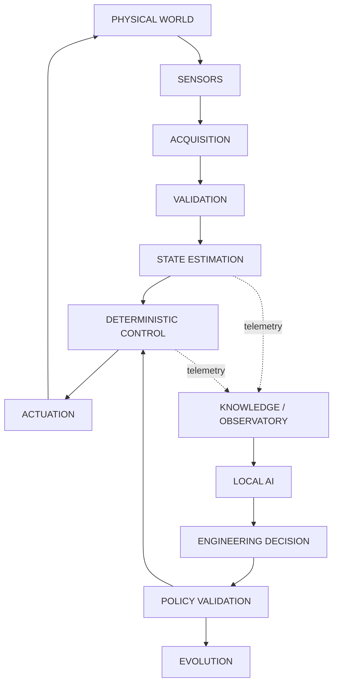
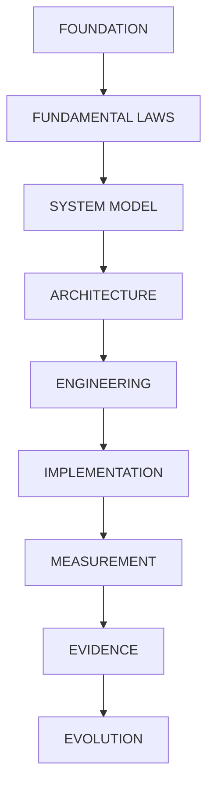
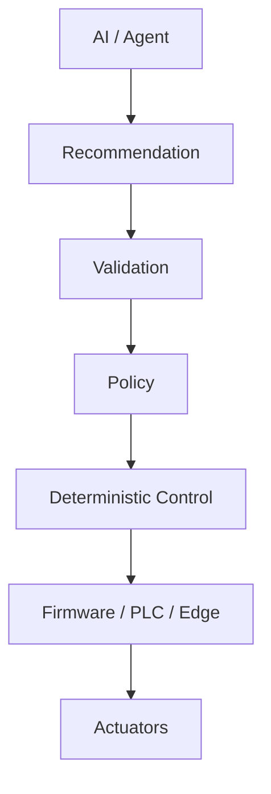
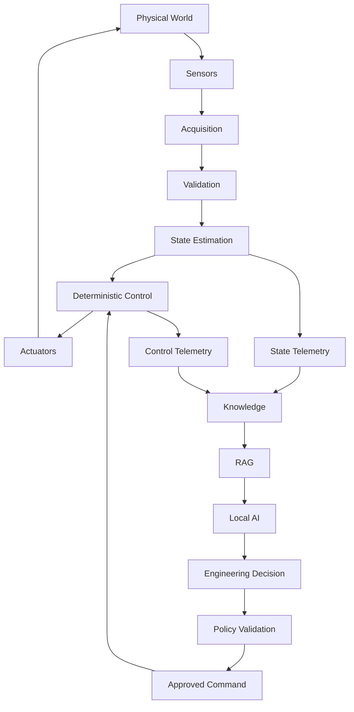
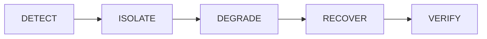
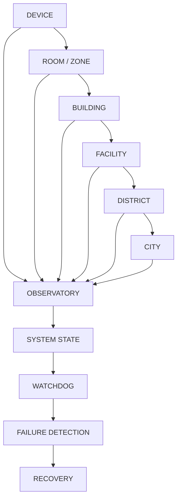
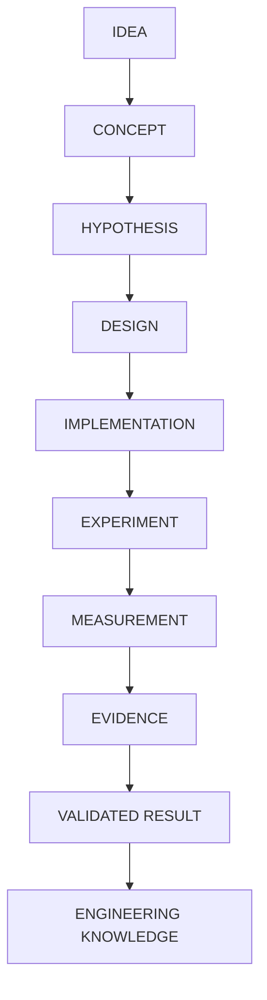

# Canonical Architecture

Artifact Type: SPEC (top-level index)
Maturity Status: DESIGN

## Core Position

This repository documents systems engineering capability across physical, digital, and decision layers.

Main thesis:

- Complex real-world systems are cybernetic systems constrained by physics, resources, information, authority, and law.
- AI is a reasoning and orchestration layer, not uncontrolled physical authority.

## Canonical Pipeline

Authoritative, detailed version with telemetry taxonomy and feedback flow: [architecture/cps/CPS_CONTROL_LOOP.md](architecture/cps/CPS_CONTROL_LOOP.md). This diagram is a summary only and must not be treated as an alternate definition.

## Foundation to Evidence Stack

## Authority Separation

Detailed contract: [architecture/security/AI_AUTHORITY_CONTRACT.md](architecture/security/AI_AUTHORITY_CONTRACT.md).

Critical rule:

- No uncontrolled LLM to GPIO/relay/dosing/pump path.

## CPS Runtime Model

Superseded by [architecture/cps/CPS_CONTROL_LOOP.md](architecture/cps/CPS_CONTROL_LOOP.md); retained here only as a compact summary consistent with that document.

## Layer Contracts

Full per-layer contracts (responsibility, inputs, outputs, state ownership, authority, failure behavior, recovery responsibility, evidence): [architecture/LAYER_CONTRACTS.md](architecture/LAYER_CONTRACTS.md).

- L0 Physical
- L1 Embedded
- L2 Edge
- L3 Network
- L4 Data/Knowledge
- L5 Intelligence
- L6 Evolution

## Reliability Contract

Full model with failure classes, detection sources, and per-stage contracts: [architecture/reliability/FAILURE_AND_RECOVERY_MODEL.md](architecture/reliability/FAILURE_AND_RECOVERY_MODEL.md).

## Observability Model

Observability is a state-construction mechanism, not only a dashboard.

## Evidence and Claim Discipline

Full model: [architecture/evidence/EVIDENCE_MODEL.md](architecture/evidence/EVIDENCE_MODEL.md).

Allowed Maturity Status values (never mixed with Artifact Type values such as POLICY, PLACEHOLDER, FLAGSHIP ARCHITECTURE):

- CONCEPT
- HYPOTHESIS
- DESIGN
- IMPLEMENTATION
- EXPERIMENT
- MEASURED
- VERIFIED
- [UNRESOLVED_SPEC: Requires Hardware/Code Verification]

Epistemic hierarchy:

## Navigation

- Canonical terminology: docs/foundations/TERMINOLOGY.md
- Foundations: docs/foundations/
- System architecture: architecture/
- Layer contracts: architecture/LAYER_CONTRACTS.md
- AI authority contract: architecture/security/AI_AUTHORITY_CONTRACT.md
- Threat model: architecture/security/THREAT_MODEL.md
- Failure/recovery model: architecture/reliability/FAILURE_AND_RECOVERY_MODEL.md
- Evidence model: architecture/evidence/EVIDENCE_MODEL.md
- Traceability: architecture/TRACEABILITY.md
- Consolidated cross-subsystem map and audit: architecture/SOVEREIGN_ENGINEERING_MAP.md
- Machine-readable schemas: schemas/
- Flagship: projects/ericaos/
- Case studies: case-studies/
- Evidence artifacts: evidence/, measurements/, experiments/
- Matrix: COMPETENCY_EVIDENCE_MATRIX.md
