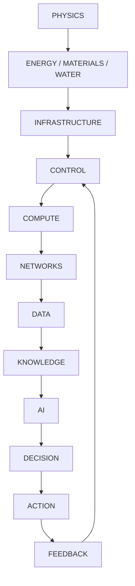

# Civilizational System Model

Artifact Type: MODEL
Maturity Status: CONCEPT

## Thesis

Complex civilization-scale systems are cybernetic systems constrained by physics, resources, information, authority, and law.

## Dependency Stack

## Domains

- Energy
- Water
- Food
- Materials
- Shelter
- Transport
- Telecommunications
- Compute
- Infrastructure
- Cybersecurity
- Economy
- Law
- Institutions
- Governance
- Education
- Medicine
- Knowledge
- Culture
- AI

## System Insight

Each domain has:

- physical constraints
- governance constraints
- information constraints
- failure modes
- recovery contracts

Cross-domain architecture is required because optimization in one domain can destabilize another.

## Portfolio Relevance

Case Study 008 maps this model into practical engineering decomposition and verifiable architecture outputs.
