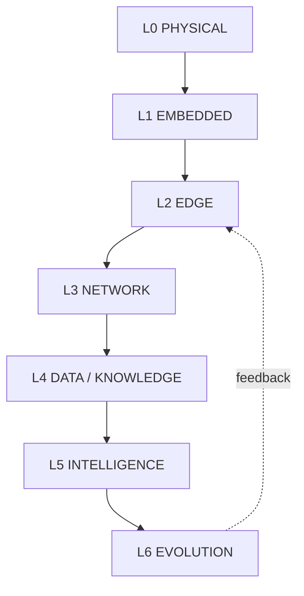

# Layer Contracts (L0-L6)

Artifact Type: SPEC
Maturity Status: DESIGN

Terminology used below follows [docs/foundations/TERMINOLOGY.md](../docs/foundations/TERMINOLOGY.md). No implementation is claimed unless explicitly stated; unknown implementation details are marked `[UNRESOLVED_SPEC: Requires Hardware/Code Verification]`.

## L0 Physical

- Responsibility: Sensors, actuators, power, physical processes.
- Inputs: Physical stimuli, actuator commands from L1.
- Outputs: Raw physical signals (Sensor Telemetry origin), physical effects (Actuation).
- State owned: Physical process state (not digitally representable directly; only observable via Sensors).
- State consumed: None (L0 has no digital state input beyond actuation commands).
- Commands accepted: Actuation commands from L1 Deterministic Control.
- Commands emitted: None.
- Trust boundary: Outermost; physically accessible, assumed untrusted unless physically secured.
- Authority level: None (passive/physical; no decision-making authority).
- Failure behavior: Physical faults (sensor drift, actuator stall) are only detectable indirectly via L1 validation.
- Recovery responsibility: None; recovery is initiated by L1.
- Evidence generated: None directly; source of all downstream Sensor Telemetry.
- [UNRESOLVED_SPEC: Requires Hardware/Code Verification] — specific sensor/actuator hardware models.

## L1 Embedded

- Responsibility: Acquisition, Validation, State Estimation, Deterministic Control, Actuation issuance (per [architecture/cps/CPS_CONTROL_LOOP.md](cps/CPS_CONTROL_LOOP.md)).
- Inputs: Sensor Telemetry from L0; policy configuration from L4/L5 (non-realtime, out-of-band).
- Outputs: Control Telemetry, Actuator Command Telemetry, Actuator Feedback Telemetry, State Telemetry.
- State owned: Local control-loop state (FSM state, validated sensor state).
- State consumed: None from higher layers in the real-time path; policy parameters consumed out-of-band.
- Commands accepted: None from L2+ in the real-time actuation path (see AI Authority Contract for the only sanctioned indirect path).
- Commands emitted: Actuation commands to L0.
- Trust boundary: Deterministic trust boundary begins here; this is the highest-authority layer for physical actuation.
- Authority level: Full authority over Actuation within its own safety envelope; cannot be preempted by L4-L6 in real time.
- Failure behavior: Must enter a defined safe state on sensor invalidation or control-loop fault; see [architecture/reliability/FAILURE_AND_RECOVERY_MODEL.md](reliability/FAILURE_AND_RECOVERY_MODEL.md).
- Recovery responsibility: Owns its own Detect -> Isolate -> Degrade transition; Recover/Verify may involve L2.
- Evidence generated: Control Telemetry logs, fault Events.
- [UNRESOLVED_SPEC: Requires Hardware/Code Verification] — firmware/platform target, exact FSM implementation.

## L2 Edge

- Responsibility: Local runtime, service supervision, telemetry aggregation, local recovery orchestration, offline operation.
- Inputs: Telemetry from L1 (all classes), configuration/policy from L3-L5.
- Outputs: Aggregated telemetry to L3, System/Service Telemetry, supervision Events.
- State owned: Service/process state, local aggregation buffers, local Observatory state (see [architecture/observability/README.md](observability/README.md)).
- State consumed: L1 Control/State Telemetry (read-only).
- Commands accepted: Deployment/configuration commands from L3+ (non-real-time), subject to Policy Validation.
- Commands emitted: Service supervision actions (restart, isolate a faulted service) — these act on L2 processes, not directly on L0 Actuation.
- Trust boundary: Edge trust boundary; assumed to run on physically-controlled hardware but network-reachable.
- Authority level: Can supervise/restart local services; cannot bypass L1 deterministic control authority.
- Failure behavior: Must continue L1 supervision during WAN/cloud disruption (offline-first).
- Recovery responsibility: Orchestrates Recover/Verify steps for L1-reported faults where L1 cannot self-recover.
- Evidence generated: Service health logs, recovery-event records.
- [UNRESOLVED_SPEC: Requires Hardware/Code Verification] — specific OS/service-supervision implementation (e.g., systemd unit design).

## L3 Network

- Responsibility: Connectivity, segmentation, identity-based access, restricted management paths.
- Inputs: Connection requests from nodes; identity credentials.
- Outputs: Authenticated/authorized network sessions; Security Telemetry.
- State owned: Network topology/segmentation state, session state.
- State consumed: Identity/policy definitions from L5/Security.
- Commands accepted: Segmentation/policy updates from authorized administrators (human authority only in current design).
- Commands emitted: None to physical/control layers; may deny/allow connectivity to L2 nodes.
- Trust boundary: Segregates trusted edge nodes from untrusted external networks.
- Authority level: Can allow/deny connectivity; cannot issue actuation or control commands.
- Failure behavior: Loss of network connectivity must not stop L1/L2 operation (offline-first principle).
- Recovery responsibility: Reconnect/re-authenticate flows; does not own physical recovery.
- Evidence generated: Connection/session audit logs.
- [UNRESOLVED_SPEC: Requires Hardware/Code Verification] — concrete mesh implementation and segmentation rules.

## L4 Data / Knowledge

- Responsibility: Structured storage of telemetry, events, decisions, provenance; knowledge base for retrieval.
- Inputs: Aggregated telemetry and Events from L2/L3.
- Outputs: Structured Knowledge artifacts, provenance-tagged records, retrieval results to L5.
- State owned: Historical/derived knowledge state (not real-time control state).
- State consumed: None from L5/L6 in a way that affects L1/L2 in real time.
- Commands accepted: Query/write requests from L5 (Intelligence), subject to schema validation.
- Commands emitted: None to control layers.
- Trust boundary: Outside the deterministic trust boundary; treated as advisory data source only.
- Authority level: None over Actuation; read/write authority over its own knowledge store only.
- Failure behavior: Unavailable or stale knowledge must degrade L5 recommendations gracefully; must never block L1/L2 operation.
- Recovery responsibility: Data integrity recovery (e.g., re-ingestion) only; not physical recovery.
- Evidence generated: Provenance records, data lineage logs.
- [UNRESOLVED_SPEC: Requires Hardware/Code Verification] — concrete database/RAG storage implementation.

## L5 Intelligence

- Responsibility: Reasoning, orchestration, capability resolution, plan generation, explanation.
- Inputs: Knowledge from L4, Intent from Human/Agent.
- Outputs: Plans, recommended Commands (not Approved Commands), AI/Agent Telemetry.
- State owned: Session/planning state only.
- State consumed: Knowledge (L4), read-only Control/State Telemetry (via Observatory, not direct).
- Commands accepted: Intent from Human.
- Commands emitted: Recommended Commands only, which must pass through [architecture/security/AI_AUTHORITY_CONTRACT.md](security/AI_AUTHORITY_CONTRACT.md) before any Execution.
- Trust boundary: Outside the deterministic trust boundary; never directly trusted for Actuation.
- Authority level: Recommendation authority only. No Execution authority over L0/L1.
- Failure behavior: Incorrect or unsafe recommendations must be rejected by Policy Validation; L5 failure must not affect L1/L2 operation.
- Recovery responsibility: None over physical systems; may recommend recovery actions subject to the same authority contract.
- Evidence generated: Plan/decision logs, rejected-recommendation Events.
- [UNRESOLVED_SPEC: Requires Hardware/Code Verification] — concrete model runtime and RAG implementation.

## L6 Evolution

- Responsibility: Aggregate evidence across layers, validate proposed engineering changes, manage Deployment.
- Inputs: Evidence from all layers, Measurement records, Validated Results.
- Outputs: Approved engineering changes (Deployment instructions), updated Policy/config for L1-L5.
- State owned: Change history, validated-result registry.
- State consumed: Evidence Model classifications from [architecture/evidence/EVIDENCE_MODEL.md](evidence/EVIDENCE_MODEL.md).
- Commands accepted: Human-approved change proposals.
- Commands emitted: Deployment commands to L2-L5 configuration (never direct real-time Actuation).
- Trust boundary: Governance boundary; requires human authority for approval per current design.
- Authority level: Can authorize Deployment of validated changes; cannot bypass L1 deterministic safety envelope.
- Failure behavior: A failed Deployment must be revertible (rollback to last known-good configuration).
- Recovery responsibility: Owns rollback of Deployments; does not own physical Recovery (that remains L1/L2).
- Evidence generated: Deployment records, validated-result archive.
- [UNRESOLVED_SPEC: Requires Hardware/Code Verification] — concrete CI/CD or change-management tooling.

## Cross-Layer Rule

No layer at L3-L6 may issue a command that results in direct Actuation without passing through L1 Deterministic Control and the AI Authority Contract where applicable. This rule is binding on all layer contracts above.
