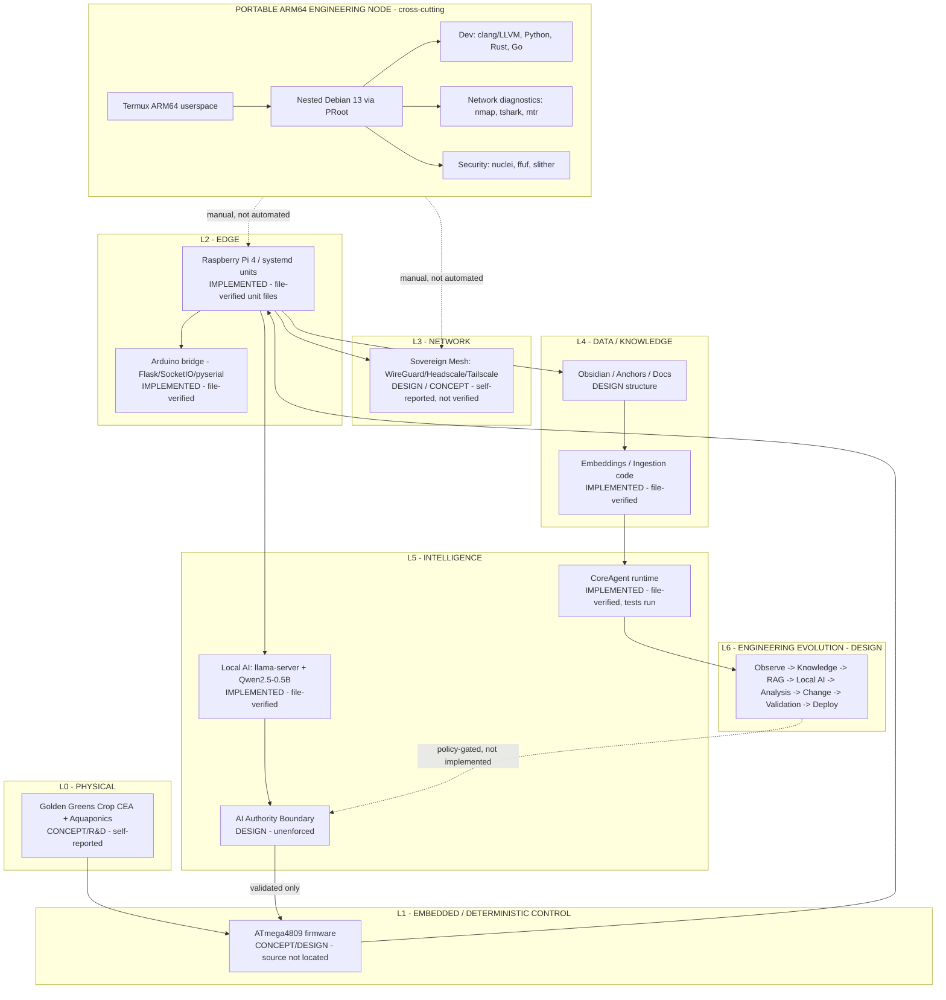

# SOVEREIGN ENGINEERING PLATFORM

Cyber-Physical Systems · Sovereign Edge · Deterministic Control · Local AI · Engineering Evolution

Artifact Type: SPEC (consolidated map)
Maturity Status: DESIGN (this map itself; component maturities below are individually sourced)

> Engineering systems that operate in the real world.

This document consolidates the cross-subsystem technology and maturity picture. It does not redefine any canonical contract; it links to the authoritative document for each. Per [architecture/evidence/EVIDENCE_MODEL.md](evidence/EVIDENCE_MODEL.md), narrative descriptions of a runtime (however detailed) are not themselves Evidence — every row below is labeled with how it was actually established: **file-verified** (this assistant inspected the artifact directly), **design document** (a canonical spec exists in this repository), or **self-reported** (described in supplied text, not independently inspected).

Inventory is not architecture. Architecture is not implementation. Implementation is not operation. Operation is not verification. Verification requires evidence.

---

## OUTPUT A — Architecture Audit

| Layer | System | Technology | Function | Artifact | Maturity | Evidence | Verification |
|---|---|---|---|---|---|---|---|
| L0 Physical | Golden Greens Crop / CEA + aquaponics | Sensors (pH, TDS/EC, DHT, DS18B20, gas), pumps, lighting, dosing | Controlled-environment agriculture, biological process control | Private codebase: Flask/SocketIO controller (`app.py`) + `IntegratedController.ino` firmware | IMPLEMENTED — PRIVATE (control/telemetry layer); CONCEPT/R&D (biological/agronomic outcome) | File-verified (control code and firmware); self-reported (agronomic outcome claims) | Control-system source inspected directly; no agronomic/yield measurement inspected or found; see [case-studies/CASE-005](../case-studies/CASE-005/README.md) |
| L0 Physical | Data-center waste-heat integration | Thermal exchange concept | Reuse of waste heat for CEA/aquaponics | Architecture text only | CONCEPT | Self-reported | Not independently verified |
| L1 Embedded | ATmega4809 firmware (`IntegratedController.ino`) | C/C++, ADC, PWM, UART, non-blocking `millis()` scheduling | Sensor acquisition, pH/EC/VPD calculation, actuator control | Private codebase, source opened and read directly | IMPLEMENTED — PRIVATE | File-verified | Firmware source inspected directly (pH calibration table, Nernst compensation, VPD formula present); not verified: on-hardware behavior, calibration accuracy; see [case-studies/CASE-003](../case-studies/CASE-003/README.md) |
| L2 Edge | Raspberry Pi 4, Debian, systemd | Edge supervision | Service restart/recovery, local orchestration | `ericaos-llm.service` and sibling units (`Download/`) | IMPLEMENTED (unit files exist) | File-verified | Verified: unit files inspected; **not verified**: unit is installed/enabled/running on any host |
| L2 Edge | Arduino bridge | Python, Flask, Flask-SocketIO, pyserial | Serial telemetry bridge, reconnect logic | `PROJECTS/0x02ERICAOS/ericaosopt/arduino-server/app.py` | IMPLEMENTED | File-verified | Verified: source inspected; **not verified**: deployed/running against real hardware |
| L2 Edge | CoreAgent | Python, asyncio | Agent runtime, model routing, memory, project ingestion | `PROJECTS/0x02ERICAOS/CoreAgent/**` | IMPLEMENTED — PRIVATE; tests exist and have been run | File-verified, test-verified | Source + `.pytest_cache/` + a persisted log (`5 passed, 8 warnings`) inspected directly; **not verified**: production deployment, measured performance |
| L2 Edge | Industrial Event Runtime Simulator (FSM slice) | Python, typed FSM | Transition guards, history, metrics | Private codebase; project's own README states "Initial Scaffold" overall | IMPLEMENTED — PRIVATE (FSM slice only) | Test-verified (FSM only) | A persisted pytest log recorded `8 passed` for `tests/test_fsm.py`; the surrounding event-sourcing/observability/simulator layers are explicitly not implemented per the project's own README |
| L3 Network | Sovereign mesh (WireGuard/Headscale/Tailscale) | Overlay networking | Private connectivity, segmentation | `headscale`/`tailscale`/`tailscaled` binaries confirmed present in a private Termux/Debian environment; `tailscaled.service` listed `enabled` on a separate Raspberry Pi host | DESIGN / CONCEPT (no mesh config or topology found) | Self-reported (raw transcript) for binaries; file-verified for the Raspberry Pi unit-state listing | Explicit checks found no running mesh process and no listening socket in the Termux/Debian environment; "enabled" on the Raspberry Pi does not establish it was running; see [case-studies/CASE-004](../case-studies/CASE-004/README.md) |
| L4 Data/Knowledge | Obsidian knowledge base, anchors, RAG ingestion | Markdown + embeddings | Engineering knowledge retention | `Docs/**`, `CoreAgent/project/knowledge_ingestion.py`, `CoreAgent/memory/embeddings.py` referenced | DESIGN (structure), IMPLEMENTED (ingestion code) | File-verified (code only) | Verified: ingestion/embedding source files exist; **not verified**: populated knowledge base content, retrieval quality |
| L5 Intelligence | Local inference (llama.cpp/llama-server, Qwen2.5-0.5B GGUF) | ARM NEON, GGUF | Local reasoning/recommendation | Model file + systemd unit | IMPLEMENTED | File-verified | Verified: model file and unit file present; **not verified**: throughput/latency figures, that the service is currently running |
| L5 Intelligence | AI authority boundary (recommendation -> validation -> deterministic control) | Policy gate | Prevents uncontrolled AI actuation | [architecture/security/AI_AUTHORITY_CONTRACT.md](security/AI_AUTHORITY_CONTRACT.md) | DESIGN | Design document | No enforcement code found in either the public repository or the inspected private-environment files |
| L6 Evolution | Engineering Evolution Loop | Observe->Knowledge->RAG->AI->Analysis->Change->Validation->Deploy | Continuous validated improvement | [architecture/evolution/README.md](evolution/README.md) | DESIGN | Design document | Not implemented in either environment |
| Cross-cutting | Portable ARM64 Engineering Node (Termux + PRoot Debian 13) | Toolchains: clang/LLVM, radare2, nmap/tshark, nuclei/ffuf, Go, Rust, Python, solc/slither | Portable development/security/diagnostics environment | See [projects/arm64-workstation/README.md](../projects/arm64-workstation/README.md) | IMPLEMENTED — PRIVATE (device exists); component maturity mixed | File-verified (two real audit report files, including an actually-executed Nmap scan); self-reported (raw transcript) for the fuller package inventory | A real localhost Nmap scan and ADB invocation were file-verified; explicit `ps`/`ss` checks in the raw transcript confirm nginx, sshd, headscale, tailscaled, named, and suricata were installed but **not running** at capture time |
| Cross-cutting | Web3/smart-contract audit stack | Foundry, Slither, Echidna, solc | Contract security analysis | Referenced only | CONCEPT / tooling roadmap | Self-reported | Not independently verified |
| Cross-cutting | Security/network observability | Suricata, Zeek, Wazuh, nmap, tcpdump | Network defense, diagnostics | Referenced only | CONCEPT / tooling roadmap | Self-reported | Not independently verified |

Contradictions found during this audit: none new beyond those already resolved in [COMPETENCY_EVIDENCE_MATRIX.md](../COMPETENCY_EVIDENCE_MATRIX.md). The recurring risk pattern is narrative text (chat-pasted "canon" documents) asserting IMPLEMENTED/VERIFIED status for items with no inspectable artifact; this audit only upgrades a row when a real file was opened and read by this assistant.

---

## OUTPUT B — Master Map (Design)

Legend (visual semantics used above):

- Solid arrow (`-->`): control or direct dependency relationship, as designed.
- Dashed arrow (`-.->`): unimplemented, manual, or unenforced relationship — explicitly not automated.
- `[IMPLEMENTED - file-verified]`: this assistant opened and read the actual artifact.
- `[DESIGN]`: a specification exists; no working implementation was found.
- `[CONCEPT / self-reported]`: described only in narrative text; no artifact was inspected.

## AI Authority Boundary (referenced, not redefined)

Canonical definition: [architecture/security/AI_AUTHORITY_CONTRACT.md](security/AI_AUTHORITY_CONTRACT.md). No uncontrolled LLM -> GPIO/relay/dosing/pump path is permitted in the design; no enforcement code for this boundary was found in the private engineering environment during this audit, so the boundary remains DESIGN-only in practice, not merely in the public repository.

## Sovereignty Boundary

LOCAL SYSTEM operation does not require cloud/public-internet availability, per architectural intent in [architecture/network/README.md](network/README.md). No deployed sovereign-mesh configuration was found to independently confirm this is operative today.

## Evidence Boundary

CLAIM -> IMPLEMENTATION -> TEST -> MEASUREMENT -> EVIDENCE -> VERIFICATION, per [architecture/evidence/EVIDENCE_MODEL.md](evidence/EVIDENCE_MODEL.md). Nothing in this map is marked MEASURED or VERIFIED; the strongest state reached by any component today is IMPLEMENTED (file-verified), which is one step below EXPERIMENT on that scale.

## Handling of Imported Narrative Content

Per repository practice already established for related projects: chat-pasted or document-pasted descriptions of system state (however detailed, confident, or internally structured) are evidence-of-a-claim, not Evidence-of-a-fact. They are classified, and only file-verified or independently reproducible content is promoted to IMPLEMENTED/MEASURED/VERIFIED status in this repository. This rule applies retroactively to this map and prospectively to any future reconciliation pass.
