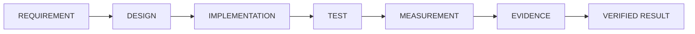

# Traceability

Artifact Type: SPEC
Maturity Status: DESIGN

Defines the mandatory traceability chain from Requirement to Verified Result. Links below point only to artifacts that exist in this repository today.

## Current Traceability Status

| Stage | Directory / Artifact | Current State |
|---|---|---|
| Requirement | Case study "Requirements" sections under [case-studies/](../case-studies/) | Present (textual) |
| Design | [architecture/](.), [docs/foundations/TERMINOLOGY.md](../docs/foundations/TERMINOLOGY.md), [schemas/](../schemas/) | Present |
| Implementation | none | Not present — no code/hardware artifacts exist in this repository |
| Test | [tests/](../tests/) | Declared zone only, empty |
| Measurement | [measurements/](../measurements/) | Declared zone only, empty |
| Evidence | [evidence/](../evidence/) | Declared zone only, empty |
| Verified Result | none | Not present |

## Rule

A traceability link may only be created from a downstream stage to an upstream artifact that actually exists in the repository at the time of writing. Do not create forward-looking links that imply an Implementation, Test, Measurement, or Evidence artifact exists when it does not. Use plain text (e.g., "not yet implemented") instead of a link in that case.

## Per-Case Traceability

Each case study under [case-studies/](../case-studies/) must state its own traceability status using this same stage list, in its "Maturity" field, rather than duplicating this table.
