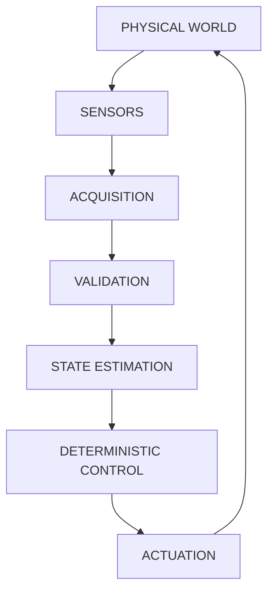
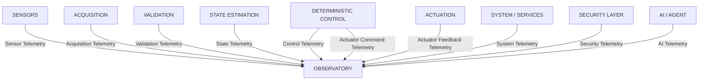
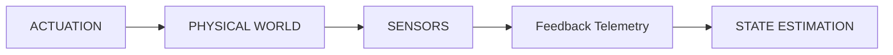
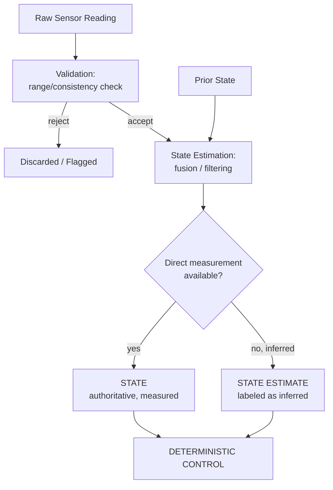

# CPS Control Loop

Artifact Type: SPEC
Maturity Status: DESIGN

This document supersedes prior informal telemetry-direction statements. See [docs/foundations/TERMINOLOGY.md](../../docs/foundations/TERMINOLOGY.md) for term definitions.

## Canonical Flow

Telemetry is not a single point in this loop. It is emitted by multiple stages concurrently with their normal function:

## Telemetry Taxonomy

| Telemetry Class | Emitted By | Describes |
|---|---|---|
| Sensor Telemetry | Sensors | Raw physical readings |
| Acquisition Telemetry | Acquisition | Sampling rate, dropped samples, timing |
| Validation Telemetry | Validation | Accept/reject decisions, out-of-range flags |
| State Telemetry | State Estimation | Current state or state estimate values |
| Control Telemetry | Deterministic Control | FSM state, active policy, control timing |
| Actuator Command Telemetry | Deterministic Control | Commands issued to actuators |
| Actuator Feedback Telemetry | Actuation / Sensors | Confirmed physical effect of a command |
| System/Service Telemetry | Edge services | Process health, resource usage |
| Security Telemetry | Security layer | AuthN/AuthZ events, policy denials |
| AI/Agent Telemetry | AI/Agent | Requests, plans, capability resolutions |

## Feedback Flow

Actuator Feedback Telemetry is re-observed as a new Sensor Telemetry cycle. It closes the loop by allowing State Estimation to confirm whether Actuation produced the expected physical result. This is a closed-loop correction path, not a separate architecture.

## State Ownership

- State Estimation owns the computed State/State Estimate for its scope.
- Deterministic Control reads State/State Estimate; it does not own it.
- No layer may silently substitute a State Estimate for directly verified State in a safety-critical decision without explicit labeling.

### State Derivation (Design)

Per [schemas/state.schema.json](../../schemas/state.schema.json), records where `kind === STATE_ESTIMATE` must carry a `derivedFrom` field; this diagram illustrates that requirement structurally.

## Telemetry Ownership

- Each telemetry class is owned (i.e., authoritative source) by exactly one producing stage, per the taxonomy table above.
- Observatory aggregates but does not own; see [architecture/observability/README.md](../observability/README.md).

## Control Authority

- Only Deterministic Control may issue Actuator Command Telemetry / commands to Actuation.
- AI/Agent may only produce recommendations that enter the AI Authority Contract; see [architecture/security/AI_AUTHORITY_CONTRACT.md](../security/AI_AUTHORITY_CONTRACT.md).
- [UNRESOLVED_SPEC: Requires Hardware/Code Verification] — concrete command transport mechanism (protocol, bus, addressing) is not yet specified.

## Failure Boundaries

- A failure in Acquisition or Validation must not propagate an unvalidated value into State Estimation; the boundary contract is: Validation either passes a value through or emits a rejection Event, never a silently-defaulted value.
- A failure in Deterministic Control must trigger the Failure and Recovery Model; see [architecture/reliability/FAILURE_AND_RECOVERY_MODEL.md](../reliability/FAILURE_AND_RECOVERY_MODEL.md).
- [UNRESOLVED_SPEC: Requires Hardware/Code Verification] — exact fault-detection thresholds per sensor/actuator class.

## Trust Boundaries

- Sensors/Acquisition/Validation/State Estimation/Deterministic Control/Actuation are considered inside the local deterministic trust boundary (L0-L1/L2).
- AI/Agent and Knowledge layers (L4-L5) are outside the deterministic trust boundary and can only reach Actuation through the AI Authority Contract.
- See [architecture/security/THREAT_MODEL.md](../security/THREAT_MODEL.md) for full trust-boundary enumeration.
