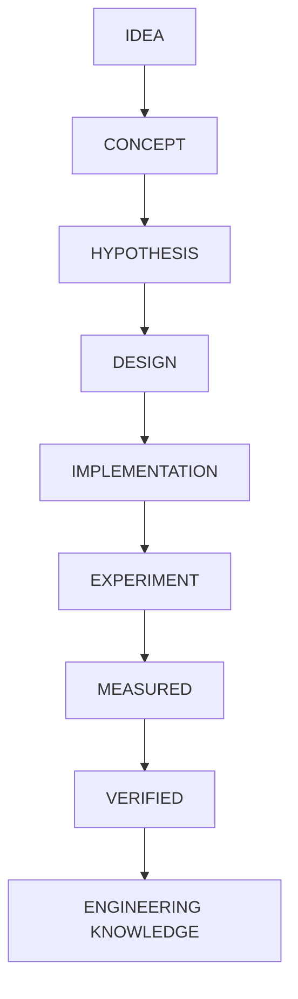
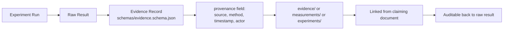

# Evidence Model

Artifact Type: SPEC
Maturity Status: DESIGN (this policy document itself is an active governance artifact; see Artifact Type note below)

Note on fields: this document is governance/policy content. Its Artifact Type is SPEC and it governs how Maturity Status is assigned elsewhere; it is not itself claiming a maturity level for any subsystem.

## Canonical Epistemic Lifecycle

## Qualification Criteria per Maturity Level

| Level | Qualifies When |
|---|---|
| IDEA | An unrecorded or informally recorded notion; not yet in this repository as a distinct artifact. |
| CONCEPT | Described in a document with a stated purpose and rationale, no design detail required. |
| HYPOTHESIS | A specific, falsifiable claim is stated about how a system will behave, with no test yet performed. |
| DESIGN | A specific architecture, contract, or schema is defined with inputs, outputs, and constraints, sufficient to guide implementation, but no working code/hardware exists. |
| IMPLEMENTATION | Working code, configuration, or hardware assembly exists in this repository or a linked artifact, independent of whether it has been tested. |
| EXPERIMENT | An implementation has been executed under a defined, repeatable procedure, with results recorded (regardless of outcome). |
| MEASURED | A quantified result exists from an experiment, with stated method and precision, per [schemas/evidence.schema.json](../../schemas/evidence.schema.json). |
| VERIFIED | A measured result has been independently reproduced or reviewed, and is recorded as a Validated Result. |
| ENGINEERING KNOWLEDGE | A verified result has been generalized into a reusable principle, referenced by subsequent designs. |

## Claim Class Distinction (mandatory)

- Marketing claim: any promotional statement — prohibited in this repository.
- Engineering requirement: a stated need or constraint, not a claim of existing capability.
- Hypothesis: see table above.
- Mechanistic hypothesis: a hypothesis that includes a proposed causal mechanism.
- Experimental result: raw outcome of a single Experiment run.
- Lab-verified result: a Measured result reproduced under controlled conditions.
- Field-validated result: a Verified result confirmed under real operating conditions.

## Enforcement Rule

No document in this repository may assert MEASURED or VERIFIED status without a linked Evidence record conforming to [schemas/evidence.schema.json](../../schemas/evidence.schema.json) that actually exists in [evidence/](../../evidence/), [measurements/](../../measurements/), or [experiments/](../../experiments/). If no such record exists, the correct status is CONCEPT, HYPOTHESIS, DESIGN, or IMPLEMENTATION as applicable, or the unresolved marker:

`[UNRESOLVED_SPEC: Requires Hardware/Code Verification]`

## Verification Level (independent axis)

Maturity Status describes lifecycle stage. **Verification Level** describes how that status was established, and is always stated alongside it when a component's implementation is discussed. This axis is never mixed with Maturity Status or Artifact Type.

| Verification Level | Evidence Class | Meaning |
|---|---|---|
| CLAIMED | E0 | A statement in a narrative document, chat export, prompt, README claim, or planning document. Not sufficient to establish implementation on its own. |
| SELF-REPORTED | E1 | Operational evidence supplied but not independently inspected by opening a file in the workspace: a terminal transcript, package inventory, command output, or manually supplied runtime snapshot. Establishes that something was reported/observed by the source, not independently verified. |
| FILE-VERIFIED | E2 | An assistant or maintainer directly opened and read the actual artifact (source file, config, systemd unit, test file, model file, build artifact) being described. |
| EXECUTED / TESTED | E3 | The artifact was actually executed or tested and the result was directly observed: a pytest run, a successful build, a real service invocation, a real hardware test, a real network scan, an integration test. Includes the sub-case **RUNTIME-VERIFIED**, where a live running process, open port, or active service was directly observed at inspection time (the strongest operational sub-state). |
| PUBLIC-VERIFIED | E4 | The artifact is sanitized and available in the public repository with reproducible instructions, so an independent third party can reproduce the result without private access. |
| UNRESOLVED | — | The specific property is not known and is not guessed; marked `[UNRESOLVED_SPEC: Requires Hardware/Code Verification]`. |

Composite label for private-environment components: **IMPLEMENTED — PRIVATE** = Maturity Status is IMPLEMENTATION, the artifact was directly inspected (FILE-VERIFIED or EXECUTED/TESTED), but Public Repository Presence is private (not exported into this repository), so Public Reproducibility (PUBLIC-VERIFIED) is not yet met.

Mandatory distinctions: `Installed ≠ Configured ≠ Running ≠ Tested ≠ Measured ≠ Verified`; `Private ≠ Non-existent`; `Not in this repository ≠ Not implemented`. A component can be IMPLEMENTED — PRIVATE and FILE-VERIFIED at the same time — these are two different axes, not synonyms, and neither one substitutes for EXECUTED/TESTED or PUBLIC-VERIFIED.

## Project Status Model (project-level rollup, distinct from per-component Maturity Status)

Individual documents (contracts, schemas, per-component rows) use **Maturity Status** (CONCEPT, HYPOTHESIS, DESIGN, IMPLEMENTATION, EXPERIMENT, MEASURED, VERIFIED). A **project** (a `projects/*/README.md` page spanning many components) additionally carries a **Project Status** rollup label, since a single project legitimately contains components at different maturity levels simultaneously:

Allowed Project Status values: `CONCEPT`, `ARCHITECTURE`, `ACTIVE DEVELOPMENT`, `IMPLEMENTED — PRIVATE`, `IMPLEMENTED — PUBLIC`, `MIXED MATURITY` (most projects in this repository qualify as MIXED MATURITY, since they combine public DESIGN-level architecture with privately FILE-VERIFIED or EXECUTED/TESTED components).

Critical rule: **absence from this public repository does not imply CONCEPT.** A component with private implementation evidence (FILE-VERIFIED or EXECUTED/TESTED in a private environment) is `IMPLEMENTED — PRIVATE`, never downgraded to CONCEPT merely because it has not been exported here. Conversely, a narrative claim (CLAIMED, E0) is never upgraded to IMPLEMENTED without FILE-VERIFIED or stronger evidence.

## Evidence Provenance Chain (Design)

Every Evidence record must carry a `provenance` object (see shared definition in [schemas/policy.schema.json](../../schemas/policy.schema.json)) so that any MEASURED/VERIFIED claim is traceable back to its raw result. No populated evidence records currently exist in this repository; the directories are declared zones only.

## Relationship to Competency Evidence Matrix

The [COMPETENCY_EVIDENCE_MATRIX.md](../../COMPETENCY_EVIDENCE_MATRIX.md) must classify every competency claim using this lifecycle and must not assign a Confidence descriptor higher than the actual Maturity Status of its linked artifact.
