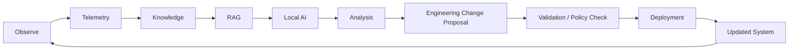

# Engineering Evolution

Artifact Type: SPEC
Maturity Status: CONCEPT

Loop:

Observe -> Telemetry -> Knowledge -> RAG -> Local AI -> Analysis -> Engineering Change -> Validation -> Deployment -> Updated System -> New Telemetry

Thesis:

The system does not merely operate. It produces evidence that enables validated engineering evolution.

## Engineering Evolution Loop (Design)

Every change must pass Validation (per [architecture/security/AI_AUTHORITY_CONTRACT.md](../security/AI_AUTHORITY_CONTRACT.md)) before Deployment. No implementation of this loop exists in this repository.
