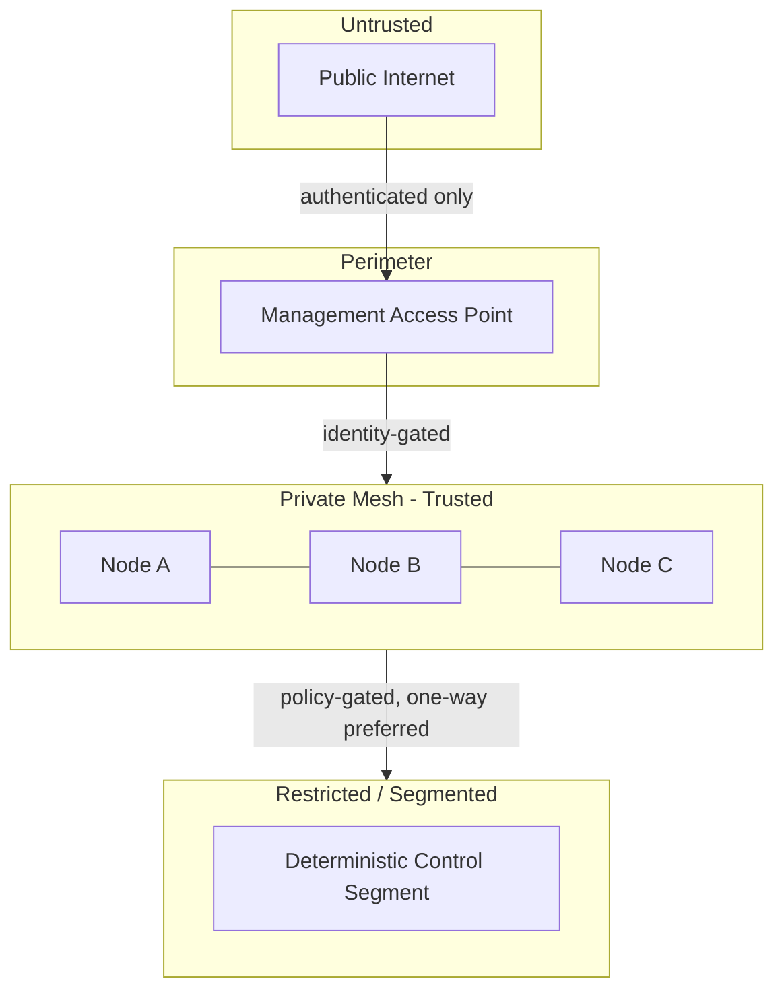

# Network Architecture

Artifact Type: SPEC
Maturity Status: CONCEPT

Scope:

- Private mesh
- Segmentation
- Restricted management paths
- Identity-based connectivity

Principle:

Connectivity is an engineered control surface, not an always-open utility.

## Trust Zones (Design)

This diagram describes intended segmentation only; no deployed topology exists in this repository. See [architecture/security/THREAT_MODEL.md](../security/THREAT_MODEL.md) for trust boundary analysis.
