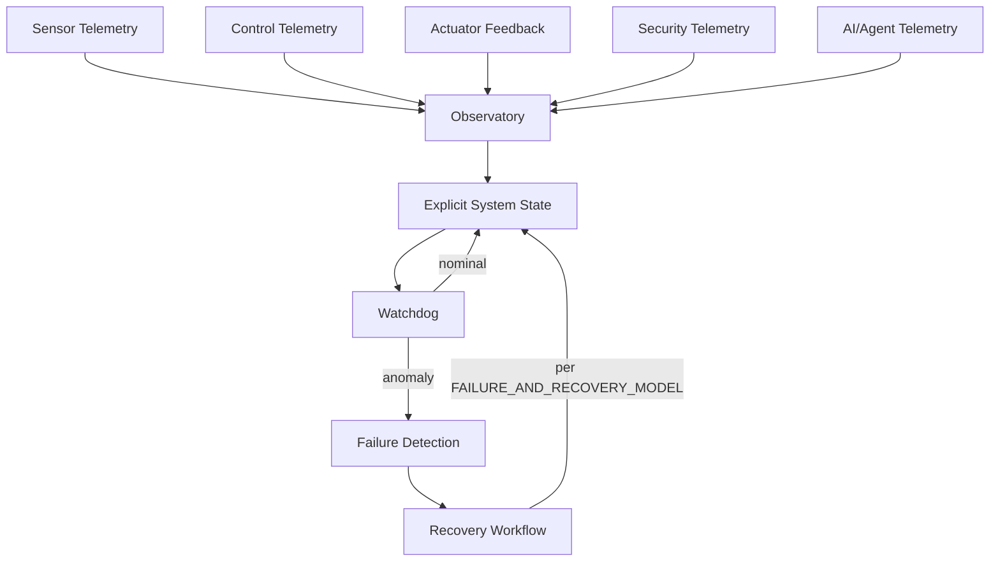

# Observatory and Watchdog

Artifact Type: SPEC
Maturity Status: DESIGN

Telemetry taxonomy this model consumes: [architecture/cps/CPS_CONTROL_LOOP.md](../cps/CPS_CONTROL_LOOP.md)

Aggregation levels:

- Device
- Room/Zone
- Building
- Facility
- District
- City

Flow:

Telemetry -> Observatory -> Explicit System State -> Watchdog -> Failure Detection -> Recovery

Observability is a state-construction and control-support mechanism.

## Observability Architecture (Design)

Source taxonomy: [architecture/cps/CPS_CONTROL_LOOP.md](../cps/CPS_CONTROL_LOOP.md). Recovery workflow: [architecture/reliability/FAILURE_AND_RECOVERY_MODEL.md](../reliability/FAILURE_AND_RECOVERY_MODEL.md). No runtime implementation exists in this repository.
