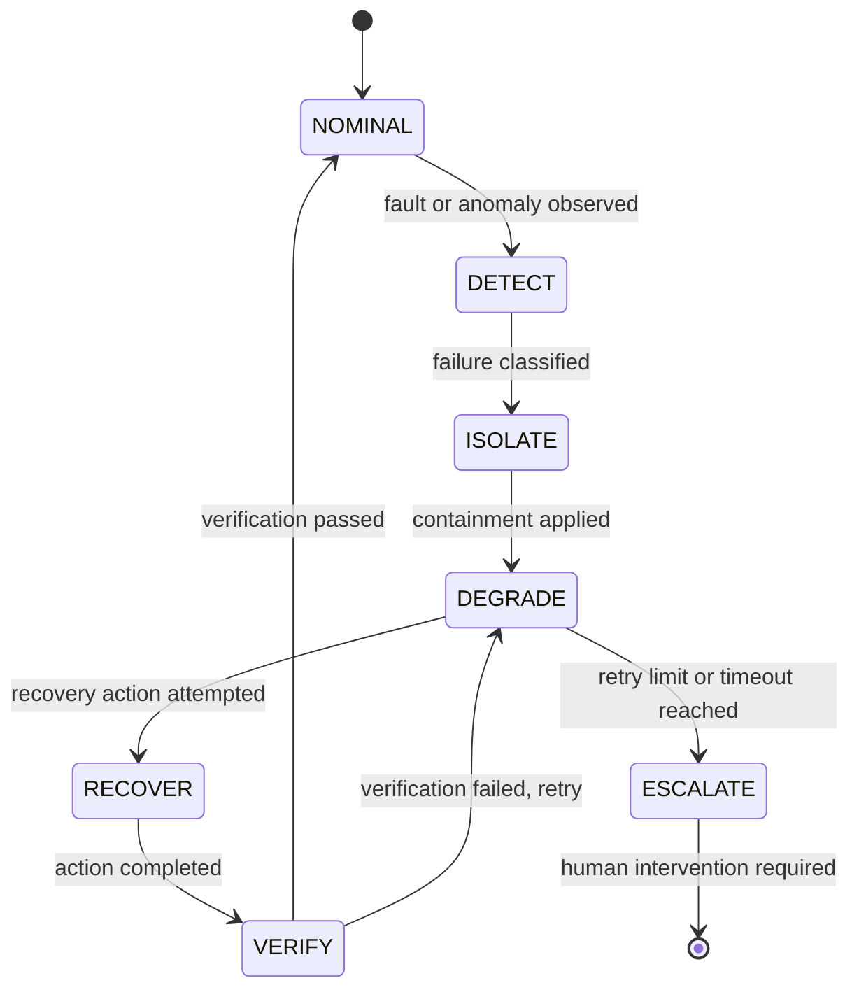

# Failure and Recovery Model

Artifact Type: SPEC
Maturity Status: DESIGN

Formalizes the reliability contract referenced across this repository. No concrete thresholds, timeouts, or safe-state values are specified where they depend on hardware or implementation not yet present in this repository.

## Canonical Sequence

## Failure Classes (categories only; not exhaustive, not hardware-specific)

| Failure Class | Description | Detection Source |
|---|---|---|
| Sensor Invalidation | Sensor Telemetry fails Validation checks | Validation stage |
| Control Loop Fault | Deterministic Control cannot reach a valid next state | Deterministic Control (self-check) |
| Actuator Non-Response | Actuator Feedback Telemetry does not confirm expected effect | State Estimation (feedback comparison) |
| Service Failure | L2 supervised process crashes or hangs | Edge service supervisor |
| Network Partition | L3 connectivity lost between nodes | Network layer health check |
| Policy Violation | A Command is denied or requires approval | Policy Engine |
| Knowledge Staleness | L4 data exceeds an undefined freshness bound | [UNRESOLVED_SPEC: Requires Hardware/Code Verification] |

## Per-Stage Contract

- Detect
  - Failure classes: any listed above.
  - Detection source: per table above.
  - Affected layer: identified at detection time.
- Isolate
  - Containment: remove the faulted component from the active control/service path without affecting unrelated components.
  - [UNRESOLVED_SPEC: Requires Hardware/Code Verification] — concrete isolation mechanism per failure class.
- Degrade
  - Safe-state definition: [UNRESOLVED_SPEC: Requires Hardware/Code Verification] — exact safe actuator positions/service fallback modes are not yet defined; must be defined per deployment before implementation.
  - Escalation owner: Human operator (L1/L2 faults), Edge administrator (L2/L3 faults), per current design; no automated escalation implementation exists.
- Recover
  - Recovery action: restart, reset to safe state, or re-validate inputs, depending on failure class.
  - Timeout: [UNRESOLVED_SPEC: Requires Hardware/Code Verification] — no timeout values are fabricated here.
- Verify
  - Verification condition: State/State Estimate returns to a value consistent with Nominal operation for a defined observation window.
  - Rollback condition: If verification fails after a bounded number of attempts, the system remains in Degrade and escalates rather than looping indefinitely.
  - Evidence emitted: A recovery-event record per [schemas/recovery-event.schema.json](../../schemas/recovery-event.schema.json).

## Cross-Reference

- Recovery is distinct from Deployment rollback; see [docs/foundations/TERMINOLOGY.md](../../docs/foundations/TERMINOLOGY.md).
- Layer-specific recovery responsibility is defined in [architecture/LAYER_CONTRACTS.md](../LAYER_CONTRACTS.md).
- Recovery events must be traceable per [architecture/TRACEABILITY.md](../TRACEABILITY.md).
