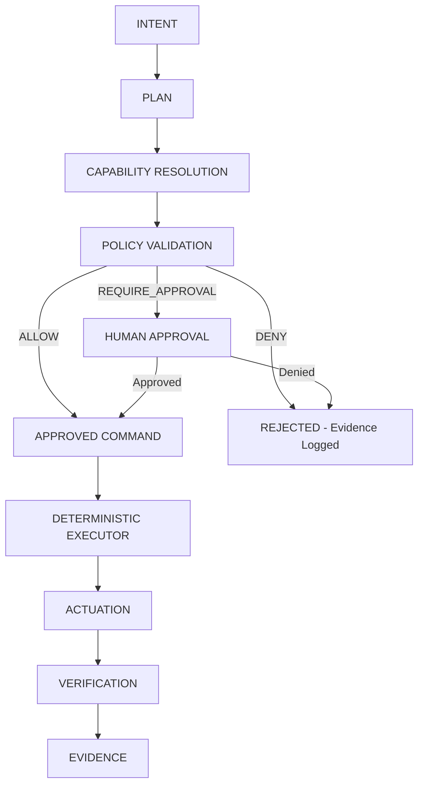

# AI Authority Contract

Artifact Type: SPEC
Maturity Status: DESIGN

This document formalizes the only sanctioned path by which AI/Agent output may influence physical Actuation. No implementation of enforcement currently exists in this repository; this is a design-level contract. Terms follow [docs/foundations/TERMINOLOGY.md](../../docs/foundations/TERMINOLOGY.md).

## Canonical Flow

## Actors

| Actor | Role |
|---|---|
| HUMAN | Ultimate authority source; can approve REQUIRE_APPROVAL decisions; can define Policy. |
| AI | Generates Intent-driven Plans and recommendations; no execution authority. |
| AGENT | Orchestrates Capability Resolution and Command submission on behalf of AI or Human. |
| POLICY ENGINE | Evaluates Commands against Policy; issues ALLOW/DENY/REQUIRE_APPROVAL. |
| DETERMINISTIC CONTROLLER | Executes only Approved Commands; owns the safety envelope (L1). |
| FIRMWARE | Lowest-level executor of Deterministic Controller instructions. |
| ACTUATOR | Physical device producing the effect. |

## Contract Fields (per Command)

- actor: identity of the requester (Human/AI/Agent), with authenticated identity where available.
- capability: the specific Capability being invoked.
- requested action: parameterized description of the intended effect.
- policy decision: ALLOW | DENY | REQUIRE_APPROVAL.
- authority level: the evaluated Authority of the actor for this capability/context.
- approved command: the Command as authorized, including any human-approval reference.
- executor: the Deterministic Executor component responsible for carrying out the command.
- verification: pass/fail result and method used to confirm expected effect.
- audit event: an immutable record of the full decision chain, timestamped.

## Policy Decisions

- ALLOW: Command proceeds directly to the Deterministic Executor.
- DENY: Command is rejected; a Rejected-Command Event and Evidence entry are recorded; no Execution occurs.
- REQUIRE_APPROVAL: Command is held pending explicit Human approval before it can become an Approved Command.

## Explicit Prohibition

The following paths are prohibited unless an enforceable deterministic authorization path (this contract, fully implemented and verified) exists:

- LLM -> GPIO
- LLM -> relay
- LLM -> pump
- LLM -> dosing
- LLM -> safety-critical actuator

No AI or Agent output may reach an Actuator without passing through Capability Resolution, Policy Validation, and a Deterministic Executor. This applies regardless of how confident or well-formed the AI output appears.

## Implementation Status

This contract is currently DESIGN only. No Policy Engine, Deterministic Executor enforcement, or audit-event pipeline is implemented in this repository. Any future claim of enforcement must reference:

- the Policy Engine implementation artifact,
- the Deterministic Executor implementation artifact,
- a passing conformance test suite demonstrating DENY/REQUIRE_APPROVAL/ALLOW behavior,

before this document's Maturity Status may be upgraded from DESIGN to IMPLEMENTATION.

[UNRESOLVED_SPEC: Requires Hardware/Code Verification] — transport/protocol for Command submission, Policy Engine technology choice, audit-event storage mechanism.
